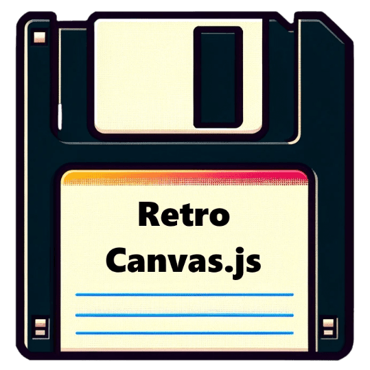

<h1>RetroCanvas.js</h1>

JS canvas based retro game library

Currently in development. The end goal is to write a JS library for making retro-style video games.

 

<a href="https://www.kentpirma.eu/RetroCanvas">RetroCanvas demos!</a>

Features added:

<ul>
  <li>Shape Camera</li>
  <li>Tile Camera</li>
  <li>Color Class</li>
  <li>2D Vector Class</li>
  <li>Asset Loader</li>
  <li>GameMath Class</li>
  <li>Sprite Sheet Animations</li>
  <li>Collision Class</li>
  <li>Verlet Physics</li>
  <li>Input Class</li>
  <li>Gamepad Support</li>
  <li>Perlin and Voronoi Noise</li>
  <li>Cellular Automata</li>
</ul>

TO-DO features:

<ul>
  <li>Inverse Kinematic</li>
  <li>Throwing Formula for GameMath</li>
  <li>Camera Shake</li>
  <li>Pathfinder Class</li>
  <li>Raycaster Camera</li>
  <li>Isometric Camera</li>
  <li>Particle System</li>
  <li>WebGL Support (with fallback to JS canvas)</li>
  <li>Editor Application</li>
  <li>Online Documentation</li>
</ul>